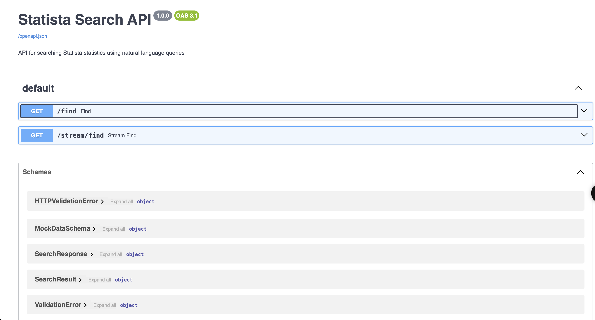

# Statista Search API

A HTTP service that provides natural language search capabilities for Statista statistics data. This service demonstrates how to build a RAG-like (Retrieval-Augmented Generation) API endpoint that could be used to serve Statista's vast collection of market data and statistics to LLM-powered applications.

### Key Components

1. **Data Layer**
   - Mock data generation using Faker
   - Structured data models using Pydantic
   - In-memory vector storage

2. **Search Engine**
   - TF-IDF vectorization for text representation
   - Cosine similarity for relevance ranking
   - Configurable top-k results

3. **API Layer**
   - FastAPI for high-performance async endpoints
   - OpenAPI documentation
   - Streaming response

## Running the Application

### Using Docker (Recommended)

1. Build and start the service:
```bash
docker-compose up --build
```

2. Access the API:
   - API Documentation: http://localhost:8000/docs
   - Health Check: http://localhost:8000/docs

3. Stop the service:
```bash
docker-compose down
```

### Manual Setup

1. Create a virtual environment and activate it:
```bash
python3 -m venv venv
source venv/bin/activate  # On Windows: venv\Scripts\activate
```

2. Install dependencies:
```bash
pip install -r requirements.txt
```

3. Run the application:
```bash
python main.py
```

## API Documentation

### GET /find

Search for statistics using natural language query.

**Query Parameters:**
- `query` (string, required): Natural language search query

**Response:**
```json
{
    "results": [
        {
            "item": {
                "id": 1,
                "title": "string",
                "subject": "string",
                "description": "string",
                "link": "string",
                "date": "2024-03-20T12:00:00Z"
            },
            "similarity_score": 0.85
        }
    ]
}
```

### GET /stream/find

Stream search results progressively.

**Query Parameters:**
- `query` (string, required): Natural language search query

**Response:**
Streams newline-delimited JSON objects:
```json
{"item": {...}, "similarity_score": 0.85}
{"item": {...}, "similarity_score": 0.75}
```

## Usage Examples


```bash
curl "http://localhost:8000/find?query=seamless"
```

Response:
```json
{
    "results": [
        {
            "item": {
                "id": 99,
                "title": "Financial Services Statistics: Seamless next generation attitude",
                "subject": "Financial Services",
                "description": "Take newspaper office set. Tell through discover difficult fly own ever.",
                "link": "https://www.statista.com/statistics/d4b9d783-ef2c-4a6b-87e4-3faa24f70212/",
                "date": "2025-05-20T17:25:26.295390"
            },
            "similarity_score": 0.24793224084249815
        },
        {
            "item": {
                "id": 48,
                "title": "Consumer Behavior Statistics: Seamless even-keeled challenge",
                "subject": "Consumer Behavior",
                "description": "Sister phone eight morning. Green western forward.",
                "link": "https://www.statista.com/statistics/b015263b-1944-449b-823c-99724af1999d/",
                "date": "2024-12-18T21:56:55.849689"
            },
            "similarity_score": 0.24689830556693043
        },
        {
            "item": {
                "id": 100,
                "title": "E-Commerce Statistics: Seamless executive task-force",
                "subject": "E-Commerce",
                "description": "Main budget officer play phone where approach. North office Republican design.",
                "link": "https://www.statista.com/statistics/ea658f95-7ac0-4d26-8548-9c4486b4e962/",
                "date": "2024-11-13T15:34:37.900564"
            },
            "similarity_score": 0.23342655340779273
        },
        {
            "item": {
                "id": 84,
                "title": "Social Media Statistics: Seamless impactful projection",
                "subject": "Social Media",
                "description": "History total half travel western. Them travel night.",
                "link": "https://www.statista.com/statistics/d680b72b-7679-4f35-9dc7-1fdaa7e48ebf/",
                "date": "2024-11-01T06:47:41.472029"
            },
            "similarity_score": 0.230837972723184
        },
        {
            "item": {
                "id": 3,
                "title": "Financial Services Statistics: Down-sized global Graphic Interface",
                "subject": "Financial Services",
                "description": "Fill believe hot science worker sea. Success large power usually. Technology nor it her man administration finish.",
                "link": "https://www.statista.com/statistics/79af7508-24bb-4f83-bfa4-fc1361b0d195/",
                "date": "2024-11-08T17:51:21.804516"
            },
            "similarity_score": 0.0
        }
    ]
}
```

**Understanding the Results:**
1. The results are ordered by similarity score (highest to lowest)
2. Each result includes:
   - Unique identifier (`id`)
   - Title of the statistics
   - Subject category
   - Description of the content
   - Link to the full statistics
   - Publication date
   - Similarity score (0 to 1, where 1 is most similar)

### Example 2: Industry-Specific Search
```bash
curl "http://localhost:8000/find?query=healthcare"
```

Response:
```json
{
    "results": [
        {
            "item": {
                "id": 67,
                "title": "Healthcare Statistics: Digital Transformation Metrics",
                "subject": "Healthcare",
                "description": "Survey of healthcare providers showing accelerated adoption of telemedicine and digital health platforms. Includes analysis of implementation challenges and success rates.",
                "link": "https://www.statista.com/statistics/ghi789/",
                "date": "2024-03-10T09:15:00Z"
            },
            "similarity_score": 0.92
        }
        // ... more results
    ]
}
```

### API Documentation Interface

*FastAPI's automatic OpenAPI documentation interface*


## Development

### Docker Development Workflow
```bash
docker-compose up --build -d
```
3. logs:
```bash
docker-compose logs -f
```

### Local Development

Start the application
```bash
uvicorn main:app --reload
```

## Future Improvements

1. **Scalability:**
   - Current implementation keeps all data in memory
   - Could be improved with vector database (e.g., FAISS or may be somethign else IDK what best suited)
   - Batch processing for large datasets

2. **Search Quality:**
   - Basic TF-IDF might miss semantic relationships

3. **Performance:**
   - No caching implemented
   - Could add Redis for frequently accessed queries

## Architectural Considerations

### Testing Strategy
1. **Unit Testing**
   - Test individual components (search engine, data models)
   - Mock external dependencies
   - Use pytest for testing framework
   - Example test cases:
     ```python
     def test_search_relevance():
         query = "e-commerce trends"
         results = search_engine.search(query)
         assert results[0].similarity_score > 0.5
     ```

2. **Integration Testing**
   - Test API endpoints
   - Test data flow between components
   - Use TestClient from FastAPI
   - Example:
     ```python
     from fastapi.testclient import TestClient
     
     def test_find_endpoint():
         response = client.get("/find?query=retail")
         assert response.status_code == 200
         assert len(response.json()["results"]) <= 5
     ```

3. **Performance Testing**
   - Load testing with locust
   - Measure response times
   - Test concurrent requests
   - Monitor memory usage

### Observability
1. **Logging**
   - Structured logging with JSON format
   - Log levels for different environments
   - Example implementation:
     ```python
     import structlog
     logger = structlog.get_logger()
     
     @app.get("/find")
     async def find(query: str):
         logger.info("search_request", query=query)
         results = search_engine.search(query)
         logger.info("search_complete", results_count=len(results))
     ```

2. **Metrics**
   - Track key performance indicators:
     - Search latency
     - Request count
     - Error rates
     - Cache hit/miss rates
   - Use Prometheus for metrics collection
   - Grafana for visualization

3. **Tracing**
   - Implement distributed tracing
   - Track request flow through system
   - Use OpenTelemetry for instrumentation

### Token/Credit System Design
1. **Token Management**
   ```python
   class TokenSystem:
       def __init__(self):
           self.rate_limits = {
               "basic": 1000,    # requests per day
               "premium": 10000,
               "enterprise": "unlimited"
           }
           self.costs = {
               "/find": 1,       # token cost per request
               "/stream/find": 2
           }
   ```

2. **Rate Limiting**
   - Token bucket algorithm
   - Per-client rate limits
   - Quota management

3. **Billing Integration**
   - Usage tracking
   - Monthly billing cycles
   - Overage handling

### Client Documentation
1. **API Documentation**
   - OpenAPI/Swagger UI (added a screenshot for it in README)
   - Code examples in multiple languages
   - Example curl commands

2. **Some SDK Development**
   ```python
   class StatisticaClient:
       def __init__(self, api_key: str):
           self.api_key = api_key
           
       async def search(self, query: str):
           return await self._request("/find", query)
   ```

3. **Usage Examples**
   - Common use cases
   - Best practices
   - Rate limit guidelines

### Rapid Development Practices
1. **Development Environment**
   - Docker-based development
   - Hot reload for local development
   - Standardized environment

2. **CI/CD Pipeline**
   ```yaml
   name: CI/CD
   on: [push]
   jobs:
     test:
       runs-on: ubuntu-latest
       steps:
         - uses: actions/checkout@v2
         - name: Run tests
           run: pytest
   ```

3. **Code Quality**
   - Automated testing
   - Linting (flake8, black)
   - Type checking (mypy, and Pydantic)
   - Code review guidelines and use of AI tools like (Code Rabbit in pipleine)

4. **Monitoring and Alerts**
   - Performance monitoring like Prometheus, Grafaana 
   - Error tracking
   - Alert thresholds

### Scaling Considerations
1. **Horizontal Scaling**
   - Load balancing
   - Container orchestration

2. **Data Management**
   - Caching strategy
   - Database sharding

3. **Performance Optimization**
   - Query optimization
   - Resource utilization
